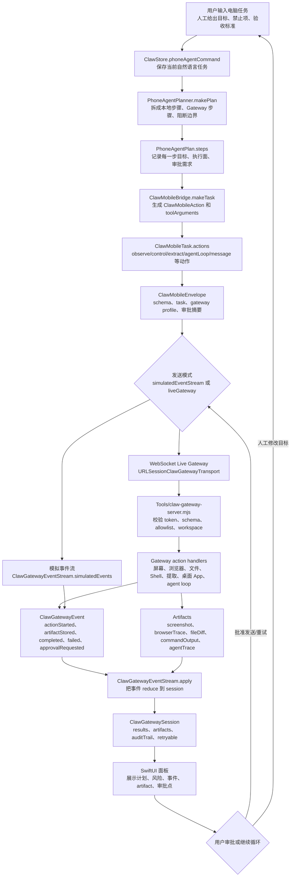
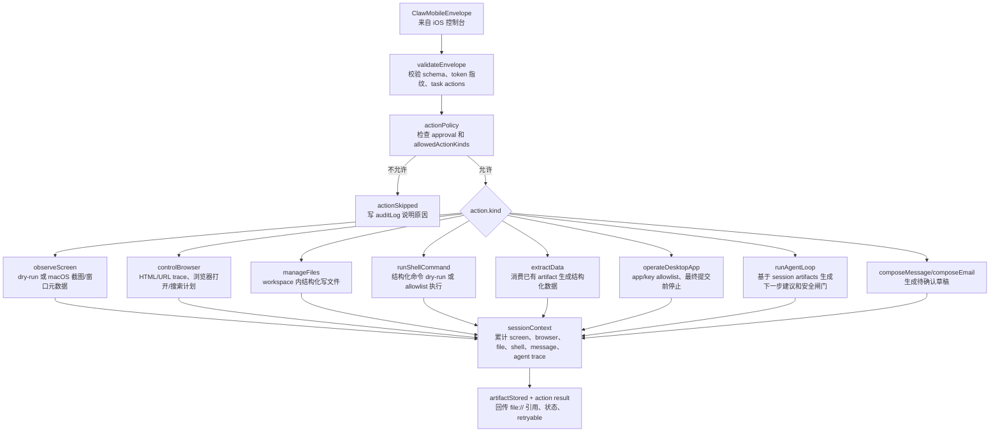
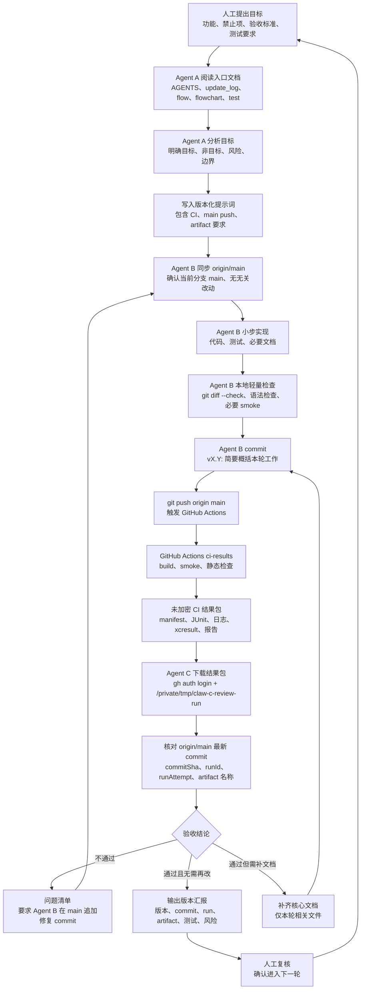

# 项目流程图

本文把 `md/flow/flow.md` 的核心逻辑画成可视化 Mermaid 图，方便人工快速复核。

## 1. Claw 核心逻辑图

读图说明：从左到右看。用户任务先进入 iPhone 控制台，经过规划、任务转换和 envelope 编码后，进入模拟事件流或桌面 Gateway。Gateway 产出事件和 artifact，手机端 reducer 把它们还原成 session，最后显示给用户审批或继续下一轮。

## 2. Gateway 执行与安全边界图

读图说明：这张图聚焦桌面 Gateway。所有动作先过策略检查，再进入具体 handler。任何真实控制都要经过 allowlist 和审批闸门；默认 dry-run 或写 artifact。

## 3. Agent 迭代与云端验证流程图

读图说明：以后新功能不直接开写。人工先提出目标，Agent A 负责分析和写实现提示词，Agent B 在 `main` 上实现、轻量检查、提交并直推 `origin/main`，GitHub Actions 生成未加密结果包，Agent C 下载结果包复判；不通过就退回 Agent B 在 `main` 上追加修复 commit，最终通过后交回人工复核。

