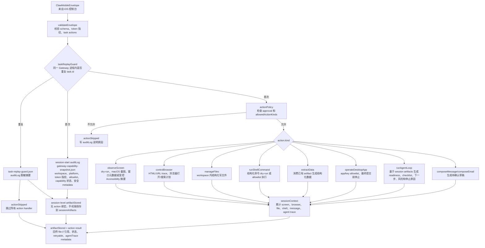
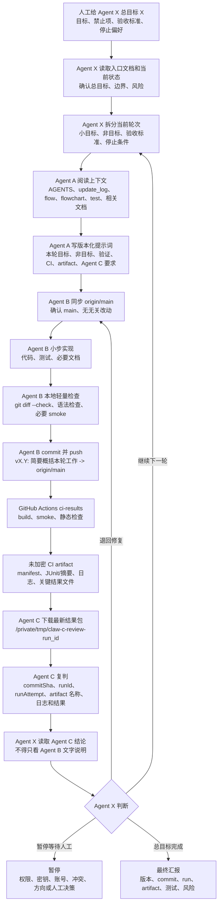

# 项目流程图

本文把 `md/flow/flow.md` 的核心逻辑画成可视化 Mermaid 图，方便人工快速复核。

## 1. Claw 核心逻辑图

读图说明：从左到右看。用户任务先进入 iPhone 控制台，经过规划、任务转换和 envelope 编码后，进入模拟事件流或桌面 Gateway。Gateway 产出事件和 artifact，手机端 reducer 把它们还原成 session，最后显示给用户审批或继续下一轮。

```mermaid
flowchart TD
  U["用户输入电脑任务<br/>人工给出目标、禁止项、验收标准"] --> S["ClawStore.phoneAgentCommand<br/>保存当前自然语言任务"]
  S --> P["PhoneAgentPlanner.makePlan<br/>拆成本地步骤、Gateway 步骤、阻断边界"]
  P --> T["PhoneAgentPlan.steps<br/>记录每一步目标、执行面、审批需求"]
  T --> B["ClawMobileBridge.makeTask<br/>生成 ClawMobileAction 和 toolArguments"]
  B --> A["ClawMobileTask.actions<br/>observe/control/extract/agentLoop/message 等动作"]
  A --> E["ClawMobileEnvelope<br/>schema、task、gateway profile、审批摘要"]
  E --> M{"发送模式<br/>simulatedEventStream 或 liveGateway"}
  M --> SIM["模拟事件流<br/>ClawGatewayEventStream.simulatedEvents"]
  M --> LIVE["WebSocket Live Gateway<br/>URLSessionClawGatewayTransport"]
  LIVE --> LREQ["ClawGatewayLiveRequest<br/>preflight、脱敏 endpoint、transport、token 指纹"]
  LREQ --> RETRY["bounded retry + ping observe<br/>attempt、reconnect、ping、transport error"]
  RETRY --> G["Tools/claw-gateway-server.mjs<br/>校验 token、schema、allowlist、workspace"]
  G --> RPLAY{"task replay guard<br/>同一进程内 task.id 是否已接受"}
  RPLAY -->|"重复"| RAUD["task-replay-guard.json<br/>session-level auditLog"]
  RAUD --> RSKIP["actionSkipped<br/>不重新执行 handler、不写业务 artifact"]
  RSKIP --> EVT
  RAUD --> RMETA["Replay Guard metadata<br/>replay 次数、动作数、digest match、安全标志"]
  RPLAY -->|"首次"| SNAP["gateway-capability-snapshot.json<br/>session-start auditLog 能力快照"]
  SNAP --> SMETA["capability snapshot metadata<br/>token 指纹、allowlist、capability 状态、safety flags"]
  RPLAY -->|"首次"| H["Gateway action handlers<br/>屏幕、浏览器、文件、Shell、提取、桌面 App、agent loop"]
  H --> ART["Artifacts<br/>screenshot、accessibilityTree、browserTrace、fileDiff、commandOutput、agentTrace 证据策略"]
  SNAP --> SART["sessionArtifacts<br/>无 action 绑定的 session 级 artifact"]
  ART --> AXMETA["accessibilityTree metadata<br/>mode、policy、节点数、候选控件、安全标志"]
  ART --> META["agentTrace artifact metadata<br/>证据分、缺口、下一步、风险、停止原因"]
  H --> EVT["ClawGatewayEvent<br/>actionStarted、artifactStored、completed、failed、approvalRequested"]
  SNAP --> EVT
  SIM --> EVT
  EVT --> R["ClawGatewayEventStream.apply<br/>把事件 reduce 到 session"]
  ART --> R
  SART --> R
  SMETA --> R
  RMETA --> R
  AXMETA --> R
  META --> R
  R --> SES["ClawGatewaySession<br/>results、sessionArtifacts、auditTrail、retryable"]
  LREQ --> LHEALTH["ClawGatewayLiveHealthSummary<br/>连接状态、attempt/reconnect/ping、最新事件、fallback/error/completed"]
  RETRY --> LHEALTH
  R --> LHEALTH
  SES --> LHEALTH
  SES --> RREVIEW["ClawGatewayTaskReplayGuardReviewSummary<br/>重复任务安全跳过复核"]
  LHEALTH --> RUN["ClawMissionRunSummary<br/>派生目标、阶段、主动作、风险、证据、Live health、Gateway 能力、Accessibility、Replay Guard 和 AgentTrace 复核"]
  RREVIEW --> RUN
  SES --> RUN
  RUN --> UI["SwiftUI Mission Run / iPad 多栏工作台<br/>展示计划、风险、事件、artifact、审批点、复核摘要"]
  UI --> LOOP{"用户审批或继续循环"}
  LOOP -->|"批准发送/重试"| M
  LOOP -->|"人工修改目标"| U
```

## 2. Gateway 执行与安全边界图

读图说明：这张图聚焦桌面 Gateway。所有动作先过策略检查，再进入具体 handler。任何真实控制都要经过 allowlist 和审批闸门；默认 dry-run 或写 artifact。



## 3. Agent X 主控循环与云端验证流程图

读图说明：未来人工可用 `agentx:` 给出总目标 X。Agent X 只做主控调度，把总目标拆成小轮次；每轮仍必须经过 Agent A 写提示词、Agent B 在 `main` 上实现并 push、GitHub Actions 生成未加密结果包、Agent C 下载 artifact 复判。Agent X 只能基于 Agent C 结论决定继续、退回、暂停或完成，不能跳过云端 artifact 验收。


