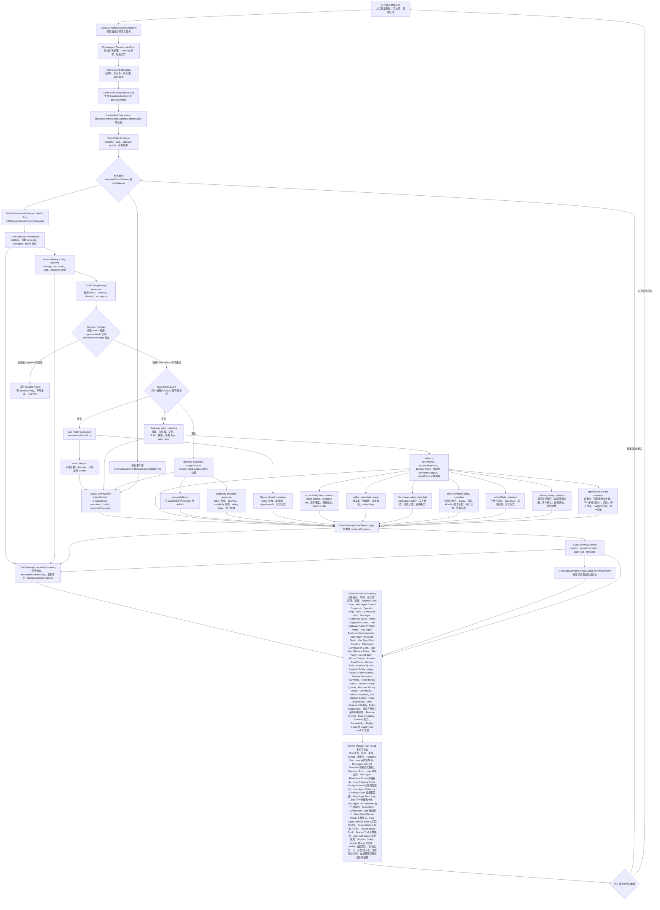
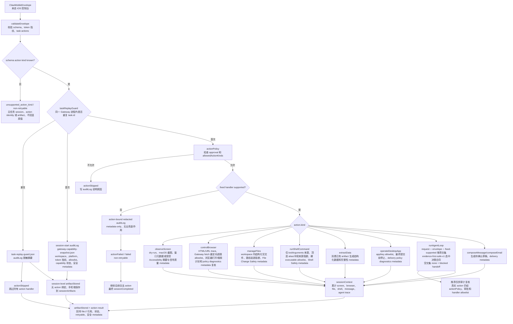
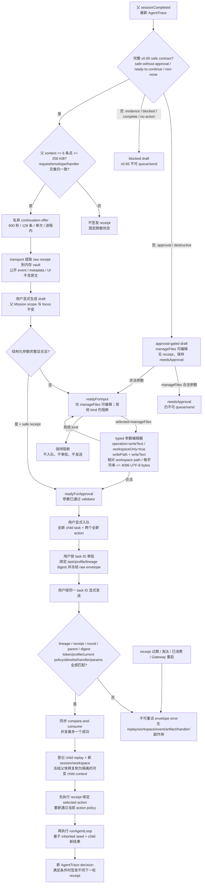
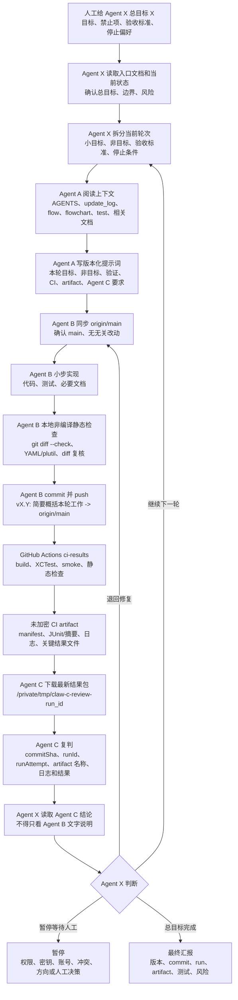

# 项目流程图

本文把 `md/flow/flow.md` 的核心逻辑画成可视化 Mermaid 图，方便人工快速复核。

v0.63 的 Mission Run 展示先以当前 task 为根，只接收同 task 的 session、request 和 events。复核聚焦绑定 task/session scope；新 Mission 或 task-to-session 切换会使旧聚焦失效，iPhone 与 iPad/mac 均恢复当前 Mission 的全量详情。

v0.66 的 continuation 不复用父 task/session/envelope/workspace。父 safe decision、Gateway receipt 和 child 用户审批是三个独立条件；receipt 只在当前 Gateway 进程内保留 10 分钟、最多 128 条并单次消费，任何失败都在 replay、workspace、event、artifact 和 handler 前停止。

v0.68 的普通首次 dispatch 只允许 `sent` 任务进入 replay、workspace 和 action 流；状态/敏感 approval preflight 失败返回无 action identity 的不可重试 envelope error。continuation 仍单独使用 `readyToSend + receipt` 合同。

## 1. Claw 核心逻辑图

读图说明：从左到右看。用户任务先进入 iPhone 控制台，经过规划、任务转换和 envelope 编码后，进入模拟事件流或桌面 Gateway。Gateway 产出事件和 artifact，手机端 reducer 把它们还原成 session，最后显示给用户审批或继续下一轮。

```mermaid
flowchart TD
  U["用户输入电脑任务<br/>人工给出目标、禁止项、验收标准"] --> S["ClawStore.phoneAgentCommand<br/>保存当前自然语言任务"]
  S --> P["PhoneAgentPlanner.makePlan<br/>拆成本地步骤、Gateway 步骤、阻断边界"]
  P --> T["PhoneAgentPlan.steps<br/>记录每一步目标、执行面、审批需求"]
  T --> B["ClawMobileBridge.makeTask<br/>生成 ClawMobileAction 和 toolArguments"]
  B --> A["ClawMobileTask.actions<br/>observe/control/extract/agentLoop/message 等动作"]
  A --> E["ClawMobileEnvelope<br/>schema、task、gateway profile、审批摘要"]
  E --> M{"发送模式<br/>simulatedEventStream 或 liveGateway"}
  M --> SIM["模拟事件流<br/>ClawGatewayEventStream.simulatedEvents"]
  M --> LIVE["WebSocket Live Gateway / Health Strip<br/>URLSessionClawGatewayTransport"]
  LIVE --> LREQ["ClawGatewayLiveRequest<br/>preflight、脱敏 endpoint、transport、token 指纹"]
  LREQ --> RETRY["bounded retry + ping observe<br/>attempt、reconnect、ping、transport error"]
  RETRY --> G["Tools/claw-gateway-server.mjs<br/>校验 token、schema、allowlist、workspace"]
  G --> PREF{"Dispatch Preflight<br/>普通 sent + 敏感 approval/audit 合同<br/>continuation lineage 分支"}
  PREF -->|"普通/continuation 合同通过"| RPLAY{"task replay guard<br/>同一进程内 task.id 是否已接受"}
  PREF -->|"状态或 approval 不合法"| PERR["固定 envelope error<br/>无 action identity、不可重试、无副作用"]
  RPLAY -->|"重复"| RAUD["task-replay-guard.json<br/>session-level auditLog"]
  RAUD --> RSKIP["actionSkipped<br/>不重新执行 handler、不写业务 artifact"]
  RSKIP --> EVT
  RAUD --> RMETA["Replay Guard metadata<br/>replay 次数、动作数、digest match、安全标志"]
  RPLAY -->|"首次"| SNAP["gateway-capability-snapshot.json<br/>session-start auditLog 能力快照"]
  SNAP --> SMETA["capability snapshot metadata<br/>token 指纹、allowlist、capability 状态、safety flags、统一脱敏"]
  RPLAY -->|"首次"| H["Gateway action handlers<br/>屏幕、浏览器、文件、Shell、提取、桌面 App、agent loop"]
  H --> ART["Artifacts<br/>screenshot、accessibilityTree、browserTrace、fileDiff、commandOutput、agentTrace 证据策略"]
  SNAP --> SART["sessionArtifacts<br/>无 action 绑定的 session 级 artifact"]
  ART --> AXMETA["accessibilityTree metadata<br/>signal quality、evidence tier、控件覆盖、省略标志、observe-only"]
  ART --> AMETA["artifact metadata review<br/>覆盖率、脱敏数、安全键值、safety flags"]
  ART --> FCMETA["file change safety metadata<br/>workspace policy、写入状态、变更计数、省略标志"]
  ART --> SHMETA["shell command safety metadata<br/>结构化命令、policy、真实 allowlist 检查证据、执行状态、省略标志"]
  ART --> EXMETA["extractData metadata<br/>完整性状态、row count、来源计数、安全标志"]
  ART --> DLMETA["delivery safety metadata<br/>最终提交闸门、桌面策略诊断、用户确认、省略状态、按键计数"]
  ART --> META["agentTrace artifact metadata<br/>证据分、交集策略与计数、下一步授权布尔、风险、停止原因、handoff 状态、统一脱敏"]
  H --> EVT["ClawGatewayEvent<br/>actionStarted、artifactStored、completed、failed、approvalRequested"]
  SNAP --> EVT
  SIM --> EVT
  EVT --> R["ClawGatewayEventStream.apply<br/>把事件 reduce 到 session"]
  ART --> R
  SART --> R
  SMETA --> R
  RMETA --> R
  AXMETA --> R
  AMETA --> R
  FCMETA --> R
  SHMETA --> R
  EXMETA --> R
  DLMETA --> R
  META --> R
  R --> SES["ClawGatewaySession<br/>results、sessionArtifacts、auditTrail、retryable"]
  LREQ --> LHEALTH["ClawGatewayLiveHealthSummary<br/>连接状态、attempt/reconnect/ping、最新事件、fallback/error/completed"]
  RETRY --> LHEALTH
  R --> LHEALTH
  SES --> LHEALTH
  SES --> RREVIEW["ClawGatewayTaskReplayGuardReviewSummary<br/>重复任务安全跳过复核"]
  LHEALTH --> RUN["ClawMissionRunSummary<br/>派生目标、阶段、主动作、风险、证据、Approval Fast Lane、Mac Agent Control Snapshot、Operator Strip、Loop Continuation Brief、Mac Agent Readiness Board / Policy Diagnostics Board、Mac Gateway Action Preflight Matrix、Mac Agent Evidence Coverage Map、Mac Agent Next Step Deck、Mac Agent Run Timeline、Mac Agent Continuation Gate、Mac Agent Review Radar、Mac Agent Handoff Brief、Focus Context、Review Detail Dock、Review Trail、Approval Queue、Payload Safety Ledger、Artifact Evidence Index、Review Readiness Summary、Next Review Action、Review Priority Queue、Focused Priority Detail、Live health、Artifact metadata、File Change Safety / Policy Diagnostics、Shell Command Safety / Policy Diagnostics、提取完整性 / 来源策略诊断、Browser Control、Delivery Safety、Gateway 能力、Accessibility、Replay Guard 和 AgentTrace handoff 复核"]
  RREVIEW --> RUN
  SES --> RUN
  RUN --> UI["SwiftUI Mission Run / iPad 多栏工作台<br/>展示计划、风险、事件、artifact、审批点、Approval Fast Lane 审批快车道、Mac Agent Control Snapshot 控制态势快照、Operator Strip、Loop 继续态势、Mac Agent Readiness Board 就绪看板、Mac Gateway Action Preflight Matrix 动作预检矩阵、Mac Agent Evidence Coverage Map 证据覆盖图、Mac Agent Next Step Deck 下一步候选卡组、Mac Agent Run Timeline 执行时间线、Mac Agent Continuation Gate 继续闸门、Mac Agent Review Radar 复核雷达、Mac Agent Handoff Brief 人工交接简报、Focus Context 聚焦上下文、Review Detail Dock、Review Trail 复核路径、Approval Queue 审批队列、Payload Safety Ledger 载荷安全账本、Artifact 证据索引、复核态势、下一步复核行动、复核优先队列、当前聚焦项和详细复核摘要"]
  UI --> LOOP{"用户审批或继续循环"}
  LOOP -->|"批准发送/重试"| M
  LOOP -->|"人工修改目标"| U
```

## 2. Gateway 执行与安全边界图

读图说明：这张图聚焦桌面 Gateway。所有动作先过策略检查，再进入具体 handler。任何真实控制都要经过 allowlist 和审批闸门；默认 dry-run 或写 artifact。

```mermaid
flowchart TD
  ENV["ClawMobileEnvelope<br/>来自 iOS 控制台"] --> VAL["validateEnvelope<br/>校验 schema、token 指纹、task actions"]
  VAL --> KNOWN{"schema action kind known?"}
  KNOWN -->|否| UERR["unsupported_action_kind / non-retryable<br/>无任务 session、action identity 或 artifact，不回显原值"]
  KNOWN -->|是| REPLAY{"taskReplayGuard<br/>同一 Gateway 进程内是否重复 task.id"}
  REPLAY -->|"重复"| RG["task-replay-guard.json<br/>auditLog 脱敏摘要"]
  RG --> RGS["actionSkipped<br/>跳过所有 action handler"]
  RG --> SOUT
  RGS --> OUT
  REPLAY -->|"首次"| SNAP["session-start auditLog<br/>gateway-capability-snapshot.json<br/>workspace、platform、token 指纹、allowlist、capability 状态、安全 metadata"]
  REPLAY -->|"首次"| POL["actionPolicy<br/>检查 approval 和 allowedActionKinds"]
  POL -->|不允许| SKIP["actionSkipped<br/>写 auditLog 说明原因"]
  POL -->|允许| HANDLER{"fixed handler supported?"}
  HANDLER -->|否| UAUD["action-bound redacted auditLog<br/>metadata-only、无业务副作用"]
  UAUD --> UFAIL["actionFailed / failed<br/>non-retryable"]
  UFAIL --> NEXT["继续后续合法 action<br/>最终 sessionCompleted"]
  HANDLER -->|是| KIND{"action.kind"}
  KIND --> OBS["observeScreen<br/>dry-run、macOS 截图、窗口元数据或受控 Accessibility 摘要与信号质量 metadata"]
  KIND --> BRO["controlBrowser<br/>HTML/URL trace、Gateway fetch 重定向逐跳 allowlist、浏览器打开/搜索计划和 policy diagnostics metadata 复核"]
  KIND --> FILE["manageFiles<br/>workspace 内结构化写文件、路径逃逸阻断、File Change Safety metadata"]
  KIND --> SH["runShellCommand<br/>仅 toolArguments 来源、顶层 alias/冲突来源阻断、裸 executable allowlist、Shell Safety metadata"]
  KIND --> EXT["extractData<br/>消费已有 artifact 生成结构化数据和完整性 metadata"]
  KIND --> APP["operateDesktopApp<br/>app/key allowlist、最终提交前停止、delivery policy diagnostics metadata"]
  KIND --> AG["runAgentLoop<br/>request ∩ envelope ∩ fixed-supported 推荐交集<br/>evidence-first-safe-v1 选中决策合同<br/>空交集 none + blocked handoff"]
  AG --> AGPOL["推荐仅供审计复核<br/>真实 action 仍经 actionPolicy、审批和 handler allowlist"]
  KIND --> MSG["composeMessage/composeEmail<br/>生成待确认草稿、delivery metadata"]
  OBS --> CTX["sessionContext<br/>累计 screen、browser、file、shell、message、agent trace"]
  BRO --> CTX
  FILE --> CTX
  SH --> CTX
  EXT --> CTX
  APP --> CTX
  AG --> CTX
  MSG --> CTX
  SNAP --> SOUT["session-level artifactStored<br/>无 action 绑定，手机端保存到 sessionArtifacts"]
  CTX --> OUT["artifactStored + action result<br/>回传 file:// 引用、状态、retryable、安全 metadata"]
  SOUT --> OUT
```

## 3. v0.66 可信跨任务续接图

读图说明：只有严格 safe 的父 AgentTrace 才可能签发 receipt。生成草稿、参数编辑、入队、审批和发送都是独立人工动作；v0.67 只为 `manageFiles` 提供固定结构化参数编辑器，approval 型建议没有派发路径。Gateway 必须先完成 continuation preflight 和原子消费，之后才能登记 replay、创建 workspace 或产生事件。

```mermaid
flowchart TD
  PARENT["父 sessionCompleted<br/>最新 AgentTrace"] --> SAFE{"完整 v0.65 safe contract?<br/>safe-without-approval / ready-to-continue / non-none"}
  SAFE -->|否: approval / destructive| APPROVALDRAFT["approval-gated draft<br/>manageFiles 可编辑<br/>无 receipt，保持 needsApproval"]
  SAFE -->|否: evidence / blocked / complete / no-action| DRAFTONLY["blocked draft<br/>v0.66 不可 queue/send"]
  SAFE -->|是| LIMIT{"父 context <= 6 条且 <= 256 KiB?<br/>request/envelope/handler 交集仍一致?"}
  LIMIT -->|否| NOOFFER["不签发 receipt<br/>固定脱敏状态"]
  LIMIT -->|是| OFFER["私有 continuation offer<br/>600 秒 / 128 条 / 单次 / 进程内"]
  OFFER --> VAULT["transport 提取 raw receipt 到内存 vault<br/>公开 event / metadata / UI 不含原文"]
  VAULT --> CREATE["用户显式生成 draft<br/>父 Mission scope 与 focus 不变"]
  CREATE --> PARAM{"结构化参数完整且合法?"}
  PARAM -->|否| INPUT["readyForInput<br/>仅 manageFiles 可编辑；其他 kind 仍阻断"]
  PARAM -->|是 + safe receipt| READY["readyForApproval<br/>参数已通过 validator"]
  INPUT -->|selected=manageFiles| EDIT["typed 参数编辑器<br/>operation=writeText / workspaceOnly=true<br/>writePath + writeText<br/>相对 workspace path / 每字符串 <= 4096 UTF-8 bytes"]
  EDIT -->|非法| INPUT
  EDIT -->|合法| READY
  APPROVALDRAFT -->|manageFiles 合法参数| APPROVALKEEP["needsApproval<br/>仍不可 queue/send"]
  APPROVALDRAFT -->|非法参数| INPUT
  INPUT -->|其他 kind| BLOCK["保持阻断<br/>不入队、不审批、不发送"]
  READY --> QUEUE["用户显式入队<br/>全新 child task + 两个全新 action"]
  QUEUE --> APPROVE["用户按 task ID 审批<br/>绑定 task/profile/lineage digest 并冻结 raw envelope"]
  APPROVE --> SEND["用户按同一 task ID 显式发送"]
  SEND --> PREFLIGHT{"lineage / receipt / round / parent / digest<br/>token/profile/current policy/allowlist/handler/params 全部匹配?"}
  PREFLIGHT -->|否| FAIL["不可重试 envelope error<br/>无 replay/workspace/event/artifact/handler/副作用"]
  PREFLIGHT -->|是| CONSUME["同步 compare-and-consume<br/>并发最多一个成功"]
  CONSUME --> CHILD["登记 child replay + 新 session/workspace<br/>冻结父快照复制为隔离的可变 child context"]
  CHILD --> SELECTED["先执行 receipt 绑定 selected action<br/>重新通过当前 action policy"]
  SELECTED --> LOOP["再执行 runAgentLoop<br/>基于 inherited seed + child 新结果"]
  LOOP --> NEXT["新 AgentTrace decision<br/>满足条件时签发不同下一轮 receipt"]
  EXPIRE["receipt 过期 / 淘汰 / 已消费 / Gateway 重启"] --> FAIL
```

raw receipt 只允许存在于 wire DTO、iOS 内存 vault、私有 frozen envelope 和 Gateway receipt cache。child 不能复用父 task/action/session ID、父 envelope、父 workspace 或父 `file://` reference；handler 失败也不会恢复已消费 receipt。本轮不支持 Shell continuation、自动审批/发送、自动重试 receipt、无人值守循环或跨进程/跨重启续接。

## 4. Agent X 主控循环与云端验证流程图

读图说明：未来人工可用 `agentx:` 给出总目标 X。Agent X 只做主控调度，把总目标拆成小轮次；每轮仍必须经过 Agent A 写提示词、Agent B 在 `main` 上实现并 push、GitHub Actions 生成未加密结果包、Agent C 下载 artifact 复判。Agent X 只能基于 Agent C 结论决定继续、退回、暂停或完成，不能跳过云端 artifact 验收。

```mermaid
flowchart TD
  H["人工给 Agent X 总目标 X<br/>目标、禁止项、验收标准、停止偏好"] --> X0["Agent X 读取入口文档和当前状态<br/>确认总目标、边界、风险"]
  X0 --> X1["Agent X 拆分当前轮次<br/>小目标、非目标、验收标准、停止条件"]
  X1 --> A0["Agent A 阅读上下文<br/>AGENTS、update_log、flow、flowchart、test、相关文档"]
  A0 --> A1["Agent A 写版本化提示词<br/>本轮目标、非目标、验证、CI、artifact、Agent C 要求"]
  A1 --> B0["Agent B 同步 origin/main<br/>确认 main、无无关改动"]
  B0 --> B1["Agent B 小步实现<br/>代码、测试、必要文档"]
  B1 --> B2["Agent B 本地非编译静态检查<br/>git diff --check、YAML/plutil、diff 复核"]
  B2 --> B3["Agent B commit 并 push<br/>vX.Y: 简要概括本轮工作 -> origin/main"]
  B3 --> CI["GitHub Actions ci-results<br/>build、XCTest、smoke、静态检查"]
  CI --> ART["未加密 CI artifact<br/>manifest、JUnit/摘要、日志、关键结果文件"]
  ART --> C0["Agent C 下载最新结果包<br/>/private/tmp/claw-c-review-run_id"]
  C0 --> C1["Agent C 复判<br/>commitSha、runId、runAttempt、artifact 名称、日志和结果"]
  C1 --> X2["Agent X 读取 Agent C 结论<br/>不得只看 Agent B 文字说明"]
  X2 --> J{"Agent X 判断"}
  J -->|继续下一轮| X1
  J -->|退回修复| B0
  J -->|暂停等待人工| WAIT["暂停<br/>权限、密钥、账号、冲突、方向或人工决策"]
  J -->|总目标完成| REPORT["最终汇报<br/>版本、commit、run、artifact、测试、风险"]
```
